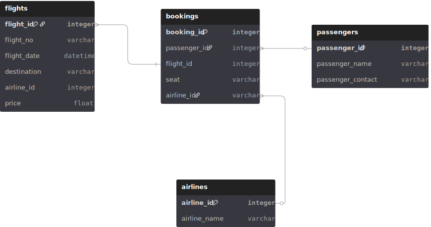
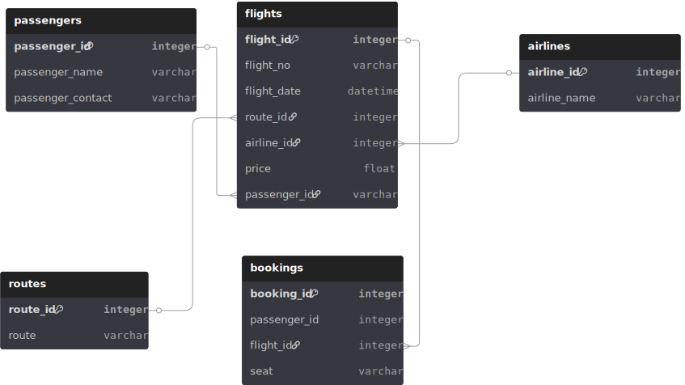
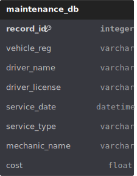
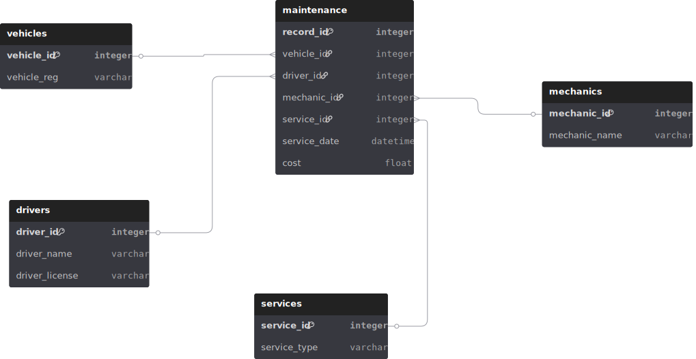
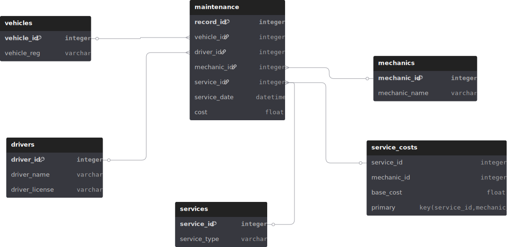
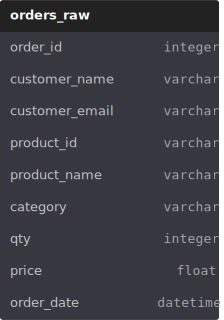
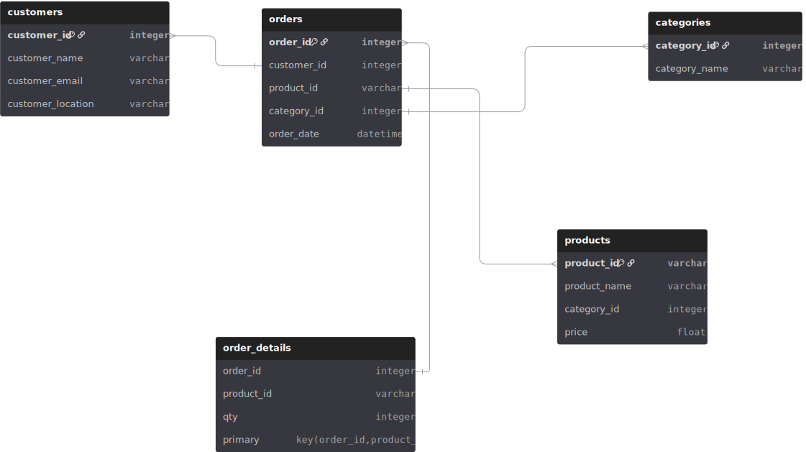
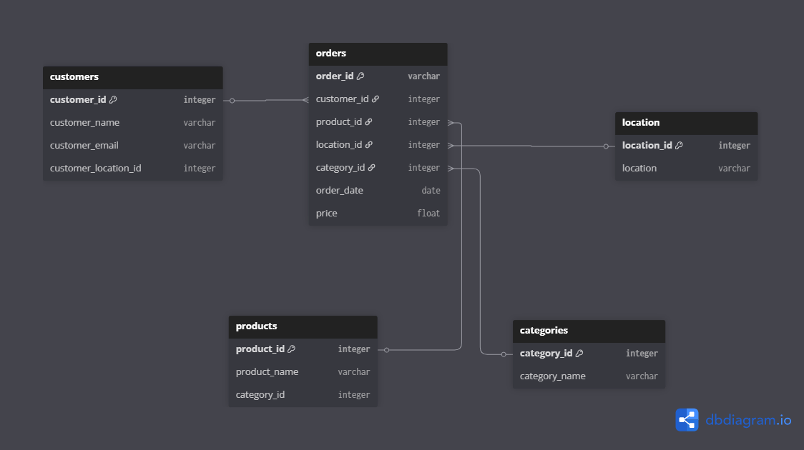

## Introduction
Data lies at the heart of every modern system. Yet, raw and unstructured data often carries redundancy, inconsistency, and inefficiency. To maximize its value, we need a structured approach to organizing it.

This project aims to demonstrate data modeling with normalization, showing how to transform messy, repetitive datasets into well-designed relational models that are:

- Efficient (no repeated updates)
- Consistent (no conflicting values)
- Scalable (supporting growth without complexity)
- Easy to query (faster and cleaner SQL)

We walk through the normalization process step-by-step, starting with 1NF (First Normal Form) and progressing to 3NF (Third Normal Form), using real-world scenarios.

## What is Normalization?

Normalization is the process of organizing data in a database to reduce redundancy and improve integrity.

#### First Normal Form (1NF): The following are criterias for a data structure to be in its first Normal Form

- Each cell must contain atomic (indivisible) values.
- No repeating groups or arrays.
- Each record is unique (primary key defined).

#### Second Normal Form (2NF): The following are criterias for a data structure to be in its second Normal Form
- Must already be in 1NF.
- Removes partial dependencies (non-key attributes depending only on part of a composite key).
- Entities are separated into different tables.

#### Third Normal Form (3NF): The following are criterias for a data structure to be in its second Normal Form
- Must already be in 2NF.
- Removes transitive dependencies (non-key attributes depending on other non-key attributes).
- Every non-key attribute depends only on the primary key.

*The goal is to design our tables into clean relational model with minimal redundancy and maximum consistency*

### About This Project

This project explores three (3) real-world industry scenarios, each beginning with raw, unstructured data in 1NF and evolving into fully normalized tables in 3NF.

#### Industries Covered
- Flight & Airline Operations – managing flights, passengers, and bookings
- Fleet Operations – tracking vehicles, drivers, and maintenance activities
- E-commerce (B2B & B2C) – handling customers, products, and orders
- Fintech – managing customers, accounts, and transactions

#### Normalization Process
For each scenario, we will:
- Start in 1NF – flat, redundant tables.
- Move to 2NF – separate entities, remove partial dependencies.
- Achieve 3NF – remove transitive dependencies, create a relational schema.

## Case Study 1: Flight & Airline Operations
Imagine AirXpress, a regional airline where bookings are stored in a single spreadsheet.

##### Problems in 1NF
- Passenger and airline names repeat for every booking.
- Updates require editing hundreds of rows.
- Queries are messy and inefficient.

**Step 1:  1NF (Flat Table)**

**Step 2: 2NF (Remove Partial Dependencies)**

- Creates passengers table that stores passenger information.
- Creates flights table stores flight details.
- Creates bookings tables link passengers to flights.
- Creates airlines table stores the airlines particularly.
  

**Step 3: 3NF (Remove Transitive Dependencies)**

- Creates routes table stores data of all routes and links to the flights table
*Result: Thousands of bookings managed without redundant updates.*

## Case Study 2: Fleet Operations
LogiFleet, a logistics company with 200+ vehicles, tracks drivers, vehicles, and services in one sheet.

##### Problems in 1NF
- Vehicle maintenance repeated.
- Driver names duplicated.
- Mechanic names inconsistent.

**Step 1: 1NF (Flat Table)**

**Step 2: 2NF**

- Separate Drivers, Vehicles, Mechanics & Services.
  

**Step 3: 3NF**

- Create Service Cost table for standardization.
  *Result: Easy reporting of cost per vehicle, driver history, etc.*

  

## Case Study 3: E-commerce (B2B & B2C)
ShopHub, an online store, tracks all orders in a single Excel sheet.

##### Problems in 1NF
- Customer emails inconsistent.
- Categories repeated thousands of times.
- Updating prices requires editing multiple rows.

**Step 1: 1NF (Flat Table)**

**Step 2: 2NF**
Order Details, Products & Categories.

**Step 3: 3NF**

- Create Location table to reference the  for standardization.

## Conclusion
Through this project, we have demonstrated how raw, redundant data can evolve into a clean, efficient, and scalable database design through the process of normalization.

By progressing from 1NF → 2NF → 3NF, we saw how a single unstructured table can be decomposed into three well-defined relational tables, each serving a distinct purpose while maintaining logical connections through primary and foreign keys.

The transformation achieved several key goals:

- Redundancy reduction: Repeated information such as customer or product details was stored only once.
- Data consistency: Changes made in one table automatically reflected across related entities.
- Integrity and scalability: Relationships between entities became explicit, reducing anomalies and enabling more complex queries.
- Analytical efficiency: Data became easier to join, aggregate, and analyze in dashboards or reports.

In practical terms, this approach is foundational for data engineers, analysts, and database designers who build reliable pipelines and business intelligence systems.
By breaking data into three interrelated tables, we’ve shown that normalization is not just a theoretical exercise — it’s a core principle for designing maintainable, high-quality data systems that scale with organizational growth.

**Key takeaway: A well-normalized database leads to cleaner data, faster queries, and more meaningful insights — the cornerstone of every successful analytics and data engineering project.**
